# Azure Setup and Role-Based Access Control (RBAC) Implementation - Week 3 Task 1

This document outlines the steps performed to observe Azure subscriptions and Entra ID, create test users and groups, assign a built-in RBAC role, and create/assign a custom RBAC role within Microsoft Azure.

---

### 1: Observe Assigned Subscriptions

**Objective:** To identify and understand the Azure subscriptions linked to my account.

**Actions Performed:**
1.  I logged into the Azure Portal.
2.  I navigated to the "Subscriptions" blade.
3.  I reviewed the active subscriptions, observing the subscription name, ID, associated directory, and billing details.

**Screenshot:**
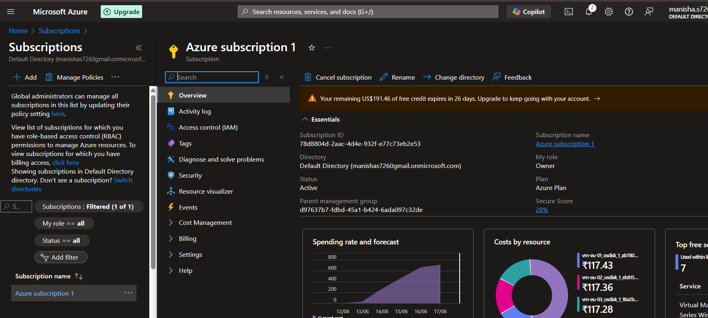
*`Images/imagestask1/azure_subscriptions_overview.png`: This image displays the "Subscriptions" overview page in the Azure portal, showing "Azure subscription 1" with its ID, directory, and spending forecast. It confirms the observation of assigned subscriptions.*

---

### 2: Observe Azure Entra ID (formerly Azure Active Directory)

**Objective:** To observe the existing Azure Entra ID tenant associated with my Azure account.

**Actions Performed:**
1.  I navigated to the "Azure Active Directory" (now Azure Entra ID) section in the Azure portal.
2.  I reviewed the overview section, which provided details of my default directory, including its name, tenant ID, primary domain, and user/group counts.

**Screenshot:**
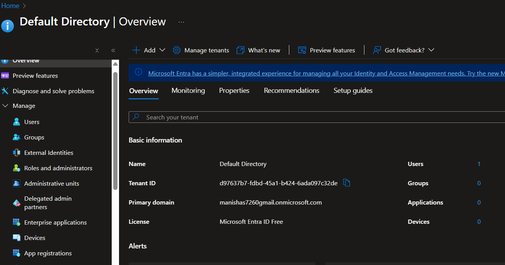
*`Images/imagestask1/azure_entra_id_overview.png`: This screenshot captures the "Default Directory | Overview" page within Azure Entra ID, highlighting the tenant ID and primary domain, confirming the observation of the Entra ID tenant.*

---

### 3: Create Test Users and Groups

**Objective:** To create non-administrative test users and security groups within Azure Entra ID for RBAC assignments.

**Actions Performed:**
1.  **Create Test Users:**
    * I navigated to the "Users" section within Azure Entra ID.
    * I created the first test user, "M's-TestUser".
    * I created the second test user, "M's-TestUser-2".
2.  **Create Security Groups:**
    * I navigated to the "Groups" section.
    * I created a security group named "TestAdminsGroup".
    * I created another security group named "TestMReadersGroup".

**Screenshots:**
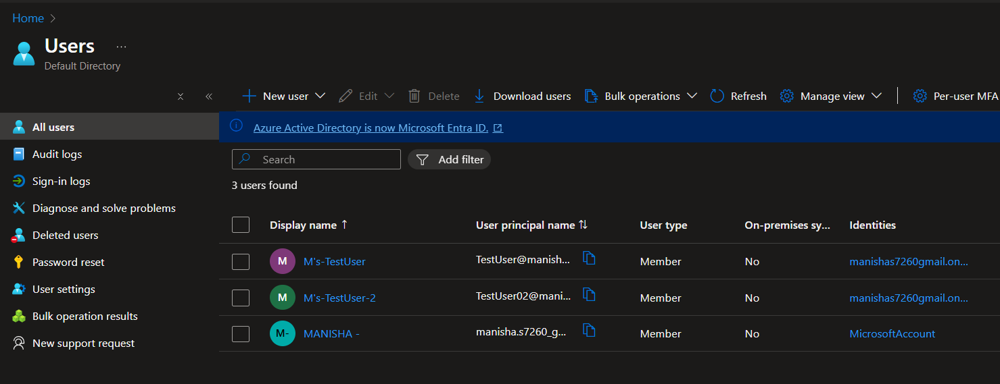
*`Images/imagestask1/azure_entra_id_users.png`: This image shows the "Users | All users" blade in Azure Entra ID, displaying the newly created test users "M's-TestUser" and "M's-TestUser-2", confirming user creation.*

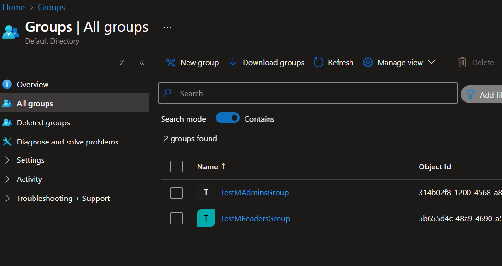
*`Images/imagestask1/azure_entra_id_groups.png`: This screenshot presents the "Groups | All groups" blade in Azure Entra ID, listing "TestAdminsGroup" and "TestMReadersGroup", confirming group creation.*

---

### 4: Assign a Built-in RBAC Role to a User and Test

**Objective:** To assign a pre-defined Azure RBAC role to a test user and verify its permissions.

**Actions Performed:**
1.  I navigated to a newly created resource group named "testing".
2.  I accessed the "Access control (IAM)" blade for this resource group.
3.  I clicked on "Add role assignment".
4.  I attempted to search for a general "Contributor" role but found it was not directly available in my environment's role list.
5.  For this assignment, I selected the **"App Configuration Contributor"** role.
6.  I assigned this role to the test user "M's-TestUser".

**Screenshots:**
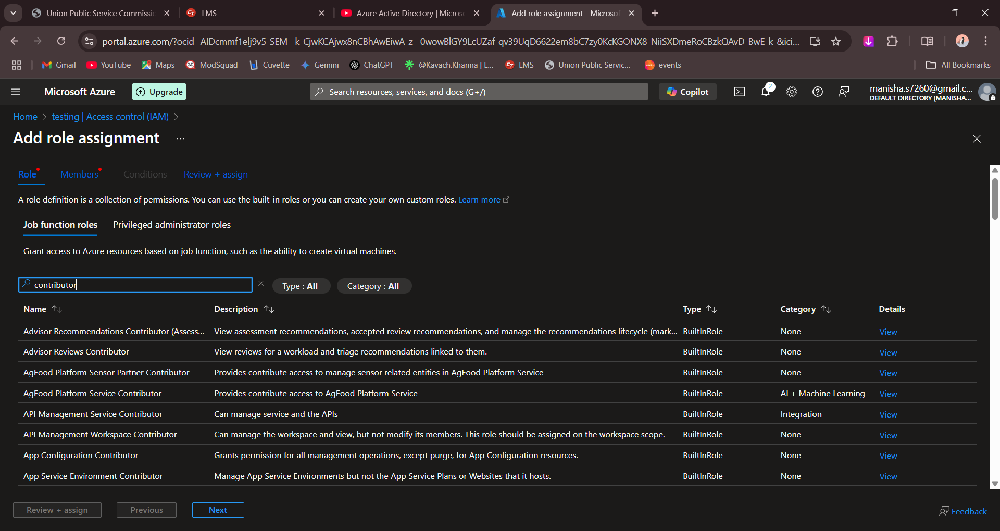
*`Images/imagestask1/rbac_add_role_assignment_search.png`: This screenshot shows the "Add role assignment" blade, demonstrating the search for "contributor" and the list of specific "Contributor" roles available, highlighting the absence of a general "Contributor" role.*

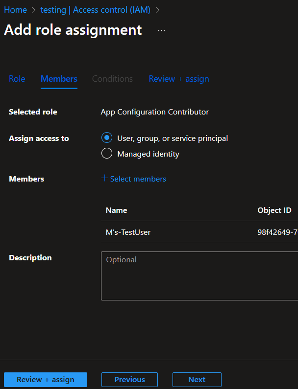
*`Images/imagestask1/rbac_assign_app_config_contributor.png`: This image confirms the selection of "App Configuration Contributor" as the role and "M's-TestUser" as the member for the role assignment within the "testing" resource group.*

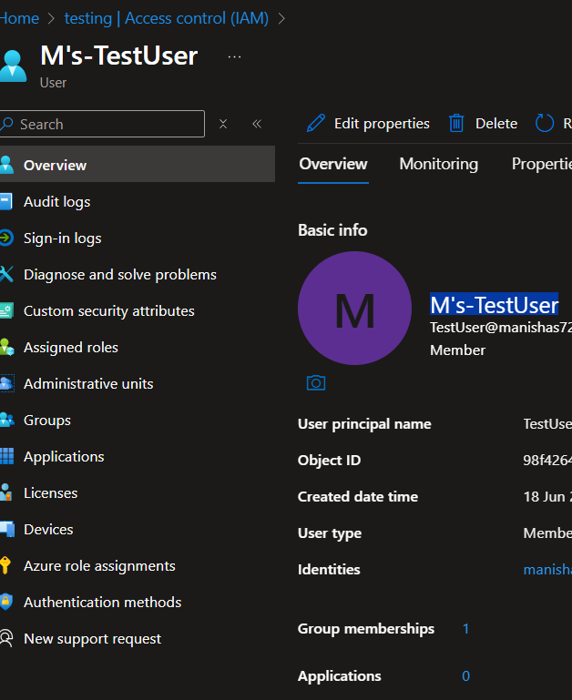
*`Images/imagestask1/testuser_overview.png`: This screenshot shows the overview page for "M's-TestUser", displaying basic information and confirming the user's existence.*

**Testing the Built-in Role:**
1.  I logged into the Azure Portal using "M's-TestUser" credentials in a private browser window.
    * During the first login, I encountered a security prompt to set up additional verification (e.g., Microsoft Authenticator).
    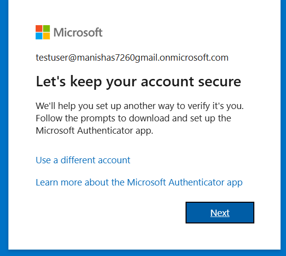
    *`Images/imagestask1/testuser_security_prompt.png`: This image captures the "Let's keep your account secure" prompt encountered during the first login of a new test user, requiring MFA setup.*
2.  I navigated to the "testing" resource group.
3.  I successfully **created/modified an Azure App Configuration resource** within the "testing" resource group. *"I successfully created an App Configuration resource named 'my-test-app-config'.")*
4.  I also attempted to create a resource *not* related to App Configuration (e.g., a Storage Account or Virtual Machine) within that same resource group. This attempt **received a "permission denied" error**, confirming that the user's permissions were limited to App Configuration.
---

### 5: Create a Custom RBAC Role, Assign to User, and Test

**Objective:** To define a custom set of permissions, create a new RBAC role with those permissions, assign it to a test user, and verify its functionality.

**Actions Performed:**
1.  **Define Custom Role Permissions:**
    * I initiated the creation of a custom role.
    * I defined the custom role named `customrolebyM`.
    * I added specific permissions to this role:
        * `Microsoft.Storage/storageAccounts/listkeys/action` (for listing storage account keys).
        * `Microsoft.Storage/storageAccounts/blobServices/containers/blobs/write` (for writing/uploading blobs to containers).
    * I set the assignable scope of this custom role to the "testing" resource group.
2.  **Assign Custom Role:**
    * I navigated to the "Access control (IAM)" blade of the "testing" resource group.
    * I clicked on "Add role assignment".
    * I selected the newly created custom role, `customrolebyM`.
    * I assigned this custom role to the test user "M's-TestUser-2".

**Screenshots:**
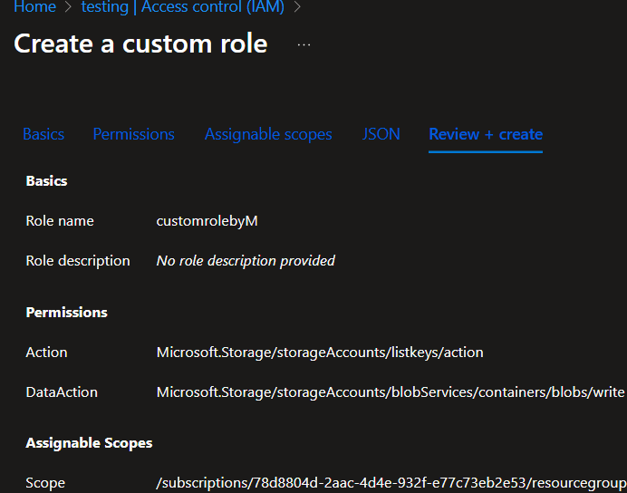
*`Images/imagestask1/custom_role_definition.png`: This screenshot shows the "Create a custom role" blade, specifically the "Review + create" tab, detailing the custom role named `customrolebyM` with permissions for `Microsoft.Storage/storageAccounts/listkeys/action` and `Microsoft.Storage/storageAccounts/blobServices/containers/blobs/write` and its assignable scope to the resource group.*

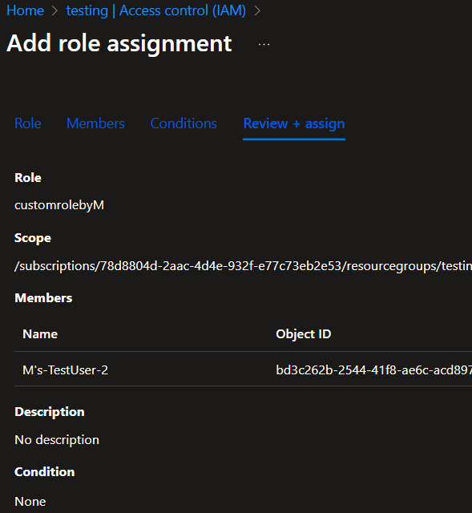
*`Images/imagestask1/rbac_assign_custom_role.png`: This image displays the "Add role assignment | Review + assign" tab, confirming the assignment of `customrolebyM` to "M's-TestUser-2" within the "testing" resource group.*

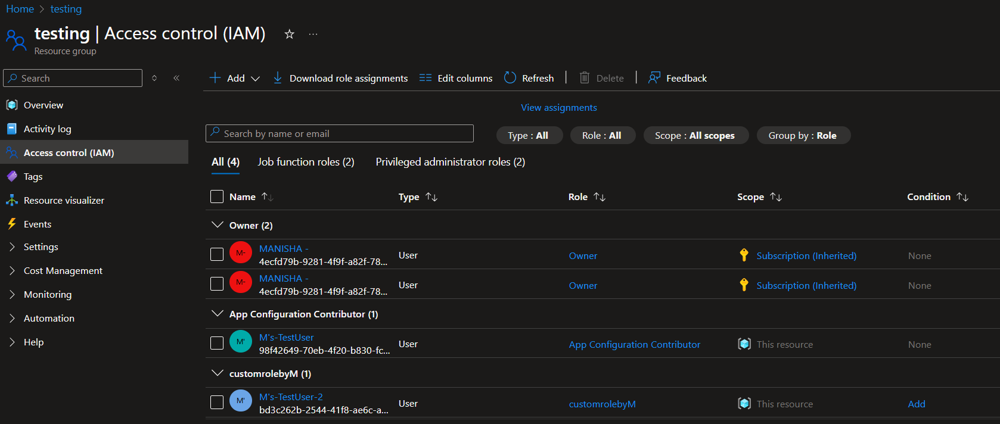
*`Images/imagestask1/rbac_resource_group_assignments.png`: This comprehensive screenshot shows the "Access control (IAM)" blade for the "testing" resource group, listing all current role assignments, including "Owner", "App Configuration Contributor" for "M's-TestUser", and "customrolebyM" for "M's-TestUser-2".*

**Additional Context (Azure CLI Interactions for Testing Setup):**
During the testing process, I also used Azure CLI commands to confirm account and subscription details, and to set up environment variables for storage operations, which would be part of testing the custom role's permissions for blob uploads.

*`Images/imagestask1/azure_cli_login_flow.png`: This screenshot shows the `az login` command in Azure Cloud Shell, including the web browser device login prompt and the initial retrieval of subscription information.*

*`Images/imagestask1/azure_cli_account_list_table.png`: This image displays the output of `az account list --output table` in Azure CLI, showing subscription details in a tabular format.*

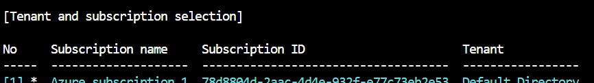
*`Images/imagestask1/cli_subscription_selection_table.png`: This screenshot presents a detailed view of the subscription selection process in Azure CLI, showing subscription ID and tenant information.*

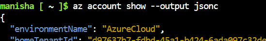
*`Images/imagestask1/cli_account_show_json_snippet.png`: This JSON snippet is from the `az account show` command, displaying environment and home tenant ID details via Azure CLI.*

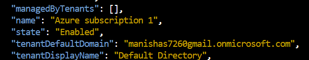
*`Images/imagestask1/cli_subscription_details_json_snippet.png`: This JSON snippet provides subscription name, state, and tenant default domain information retrieved using Azure CLI.*

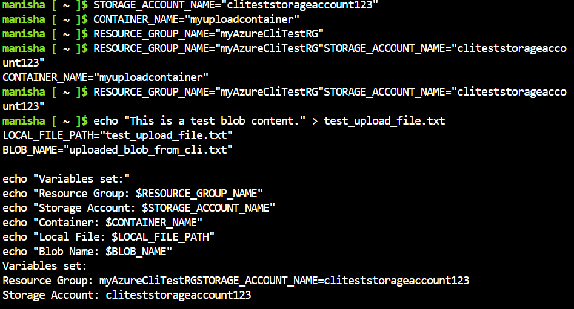
*`Images/imagestask1/cli_storage_variables_setup.png`: This terminal output shows the setup of environment variables for a storage account, container name, and blob file, in preparation for Azure CLI-based blob upload operations (relevant for testing the custom role).*

**Conclusion:**
This assignment has provided hands-on experience with Azure Subscriptions, Azure Entra ID for identity management, and the crucial concept of Role-Based Access Control (RBAC) through assigning both built-in (specific contributor) and custom roles. The detailed steps for creating users, groups, defining permissions, and the subsequent testing phases helped solidify the understanding of how permissions are enforced and how custom roles can provide granular access control in Azure environments.