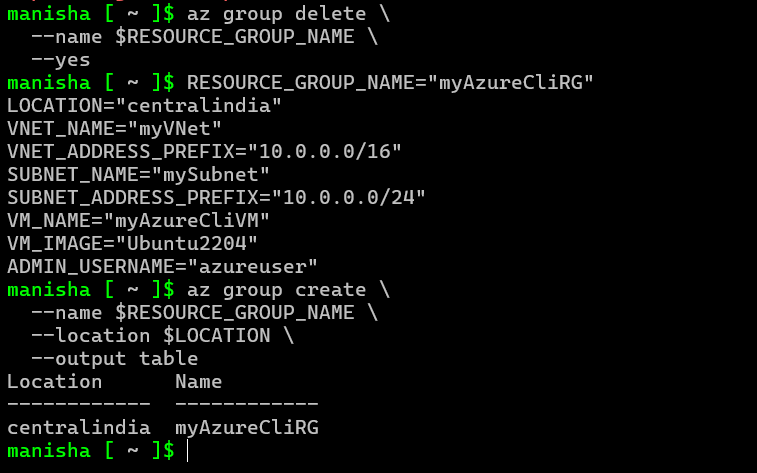
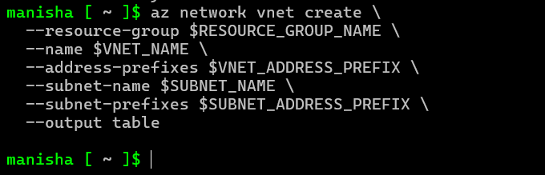
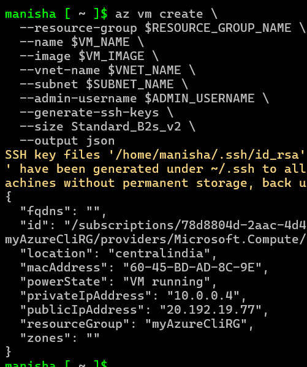
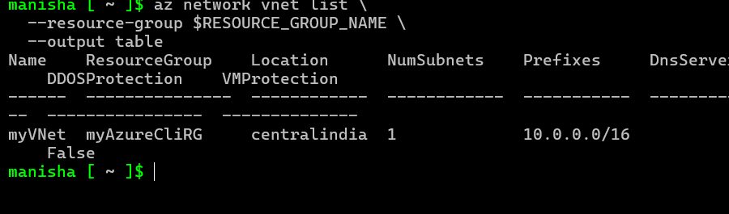
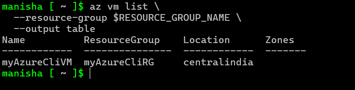
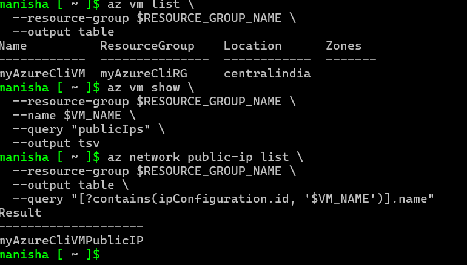
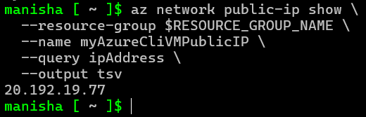
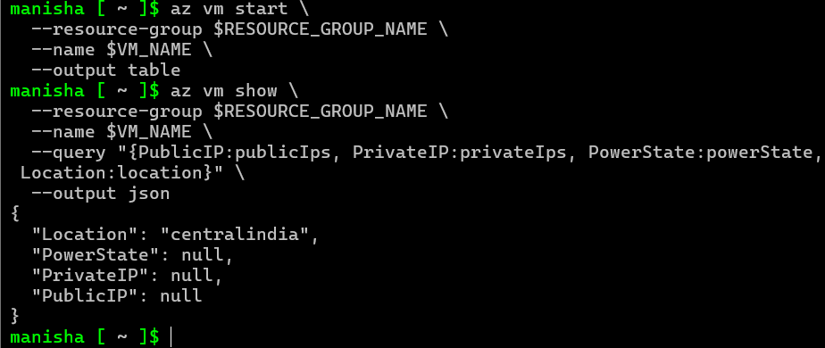
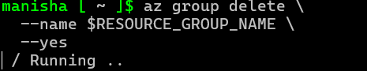
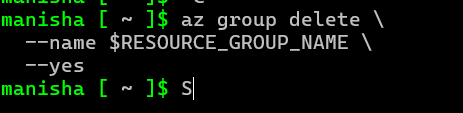

 # Task 2: Create Virtual Machine and VNet from Azure CLI – Week 3

This task involves using Azure CLI to build and manage essential cloud resources. We started by creating a resource group, then configured a virtual network with a subnet, deployed a virtual machine, and finally tested and cleaned up our setup. Each step helped reinforce practical Azure skills and CLI familiarity.

---

### Step 1: Create a Resource Group

**Command:**
```bash
az group create --name myAzureCliRG --location centralindia
```

**Screenshot:**  


**Explanation:**  
*We began by creating a resource group, which acts like a container that holds related resources for a solution. Naming it `myAzureCliRG` helped us keep everything organized and trackable.*

---

### Step 2: Create a Virtual Network

**Command:**
```bash
az network vnet create --resource-group myAzureCliRG --name myVNet --subnet-name mySubnet
```

**Screenshot:**  


**Explanation:**  
*Next, we created a virtual network to allow communication between resources. A subnet was added inside it to logically group VMs and manage traffic within the VNet. This setup is crucial for a secure and efficient network architecture. The `--resource-group` flag ensured the VNet was created within the previously made resource group.*

---

### Step 3: Create a Virtual Machine

**Command:**
```bash
az vm create --resource-group myAzureCliRG --name myAzureCliVM --image UbuntuLTS --generate-ssh-keys
```

**Screenshot:**  


**Explanation:**  
*We launched a Linux virtual machine named `myAzureCliVM`. This included automatic SSH key generation for secure login, showing how easy VM provisioning can be via CLI.*

---

### Step 4: Verify VNet Creation

**Command:**
```bash
az network vnet list --output table
```

**Screenshot:**  


**Explanation:**  
*This step confirmed that our virtual network was successfully created and exists within the correct resource group. The `--output table` flag provided a clear, tabular view of the VNet details. This verification step is essential for ensuring the integrity of our network setup. The output should display the VNet we created, confirming its existence. If it doesn't, it might indicate a misstep in the previous steps. Always verify your work to ensure accuracy and avoid potential issues down the line.*

---

### Step 5: Verify Virtual Machine List

**Command:**
```bash
az vm list --output table
```

**Screenshot:**  


**Explanation:**  
*We listed all the VMs to confirm that `myAzureCliVM` was successfully deployed and active.*

---

### Step 6: Verify Public IP Resource Name

**Command:**
```bash
az network public-ip list --output table
```

**Screenshot:**  


**Explanation:**  
*Here, we identified the name of the Public IP resource associated with our VM, which is useful for managing or modifying it later. This step ensures we have the correct resource name for future reference or modification. The output should display the Public IP resource name, confirming its existence and association with our VM. This verification step is crucial for ensuring the correct setup of our VM's network configuration.*

---

### Step 7: Get the Actual Public IP

**Command:**
```bash
az network public-ip show --resource-group myAzureCliRG --name myAzureCliVMPublicIP --query ipAddress --output tsv
```

**Screenshot:**  


**Explanation:**  
*This command extracted the actual public IP address of the VM so we can access or connect to it remotely.*

---

### Step 8: Troubleshoot VM Start (if applicable)

**Command:**
```bash
az vm start --name myAzureCliVM --resource-group myAzureCliRG
az vm show --name myAzureCliVM --resource-group myAzureCliRG --query "instanceView.statuses[?starts_with(code,'PowerState/')].displayStatus" --output tsv
```

**Screenshot:**  


**Explanation:**  
*In case the VM didn’t start correctly, this step allowed us to force-start it and verify its running state to ensure everything was working as expected. If the VM was not in a running state, we would troubleshoot further. This step is crucial for ensuring the VM is operational and ready for use.*

---

### Step 9: Delete the Resource Group (Cleanup)

**Command:**
```bash
az group delete --name myAzureCliRG --yes --no-wait
```

**Screenshot (Execution):**  


**Explanation:**  
*We executed a cleanup command to delete all the resources under our resource group—an essential step to avoid unwanted charges. This command ensures our Azure resources are properly cleaned up after use. This step is critical for maintaining a clean and organized Azure environment. Note that this command will delete all resources within the specified resource group, so use it with caution.*

**Screenshot (Confirmation):**  


**Explanation:**  
*The CLI confirmed the deletion request was accepted, signaling the completion of our cloud lab for this task. This step is essential for maintaining a clean and organized Azure environment. Note that this command will delete all resources within the specified resource group, so use it with caution. This is the final step in our Azure CLI tutorial. We have successfully completed the setup and cleanup of our Azure resources.*
