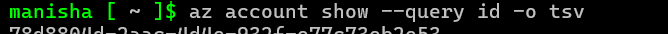

# Task 3: Create and Assign an Azure Policy via CLI – Week 3

## 📋 Task Summary

In this task, we explored Azure Policy to enforce governance by creating a custom policy definition that **denies the creation of Public IPs**. We defined the rule in a JSON file, used Azure CLI to create and assign the policy at the subscription level, and finally verified the assignment. This policy will prevent users from creating Public IPs, ensuring a helps maintain a secure and compliant environment by preventing the exposure of public IPs.
---

### Step 1: Login to Azure CLI

**Command:**
```bash
az login
```

**Screenshot:**  


**Explanation:**  
*Logged into Azure successfully using the `az login` command to authenticate the CLI session.*

---

### Step 2: Get the Subscription ID

**Command:**
```bash
az account show --query id --output tsv
```

**Screenshot:**  


**Explanation:**  
*Fetched the subscription ID to use as scope while assigning the policy later.*

---

### Step 3: Create the Policy Rule JSON File

**Command:**
```bash
code deny-public-ip-rule.json
```

**Screenshot:**  


**Explanation:**  
*Created a JSON definition that denies creation of Public IP resources. This file will be used to create the policy definition. The JSON file contains the policy rule definition.*

---

### Step 4: Create the Policy Definition in Azure

**Command:**
```bash
az policy definition create --name 'deny-public-ip' --rules deny-public-ip-rule.json --display-name 'Deny Public IPs' --description 'This policy denies creation of public IPs' --mode All
```

**Screenshot:**  


**Explanation:**  
*Defined the policy in Azure using our custom rule and assigned a display name and description. The policy is set to enforce on all resources. Uploaded and registered the custom policy definition in Azure with a user-friendly name and description.*

---

### Step 5: Assign the Policy at Subscription Scope

**Command:**
```bash
az policy assignment create --name 'deny-public-ip' --policy deny-public-ip --scope /subscriptions/<your-subscription-id>
```

**Screenshot:**  


**Explanation:**  
*Assigned the policy to the entire subscription so that the restriction applies across all resources. The policy is now enforced at the subscription level, preventing the creation of public IPs. We can verify this by attempting to create a public IP resource. If the policy is correctly enforced, the creation will be denied. Assigned the policy at the subscription level so it applies to all resources under that scope.*

---

### Step 6: Verify the Policy Assignment

**Command:**
```bash
az policy assignment list --query "[?name=='deny-public-ip']"
```

**Screenshot:**  


**Explanation:**  
*Verified that the policy assignment exists and is actively enforced.*

---

### ❌ Common Mistake – Invalid JSON Format

**Screenshot:**  


**Explanation:**  
*This screenshot captures an earlier failed attempt to define the policy due to an incorrectly formatted JSON rule file. The error message indicates that the JSON is invalid, which is a common mistake when creating custom policies.*

**💡 What Went Wrong:**  
*A missing comma in the JSON caused a syntax error during policy definition creation via CLI.*

**✅ Solution:**  
*The error was fixed by correcting the syntax and validating the file structure before re-running the command. This ensures the policy is correctly defined and can be successfully applied to resources.*

**📌 Best Practice:**  
*Always validate your JSON files before using them in production environments. Syntax issues are common, especially when editing manually. Tools like [`jq`](https://stedolan.github.io/jq/) are helpful for checking structure and spotting errors early. Consider using a code editor with JSON syntax highlighting for better readability and error detection.*

**To validate a JSON file using jq:**

```bash
jq . deny-public-ip-rule.json
