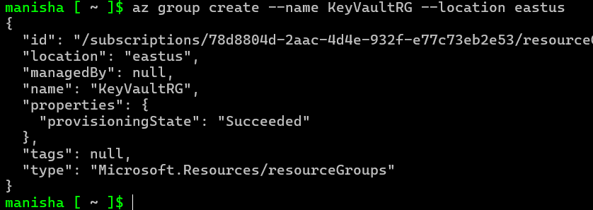
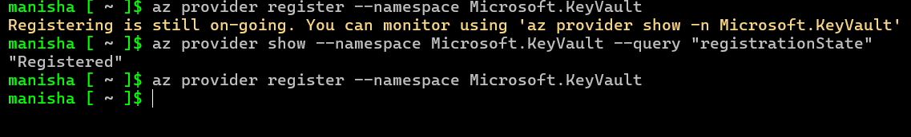
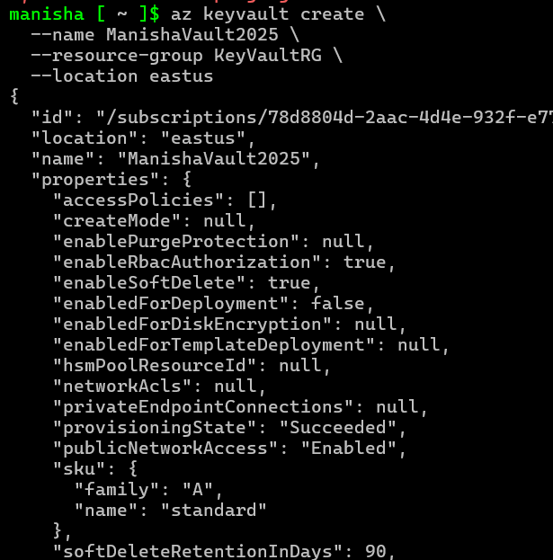
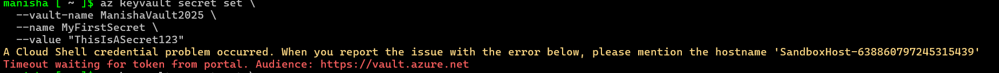
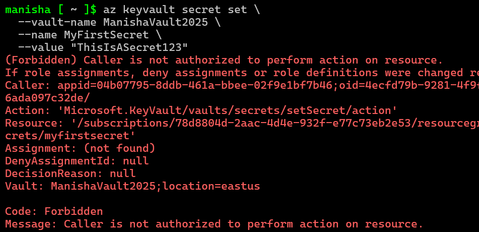
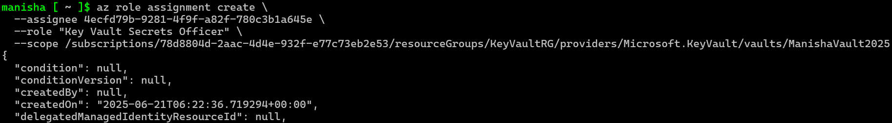
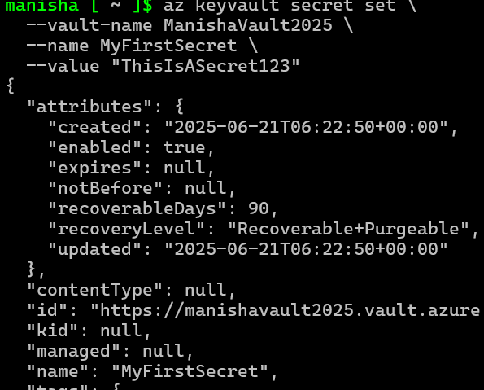
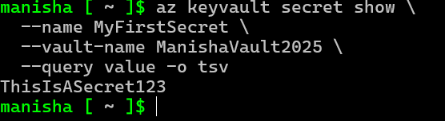

# Task 4: Create Azure Key Vault, Store & Retrieve Secrets using Azure CLI

## Summary
In this task, we created an Azure Key Vault, configured access policies, and securely stored a secret in it.  
We also handled permission issues and successfully retrieved the secret using Azure CLI, demonstrating secure secrets management in the cloud. 

---

### Step 1: Register KeyVault Resource Provider

**Command:**
```bash
az provider register --namespace Microsoft.KeyVault
```

**Screenshot:**  


**Explanation:**  
*Registers the Key Vault provider to make sure we can create vaults in our subscription. This step is crucial for setting up Key Vault.*

---

### Step 2: Create a Resource Group

**Command:**
```bash
az group create --name KeyVaultRG --location eastus
```

**Screenshot:**  


**Explanation:**  
*Creates a dedicated resource group to hold the Key Vault. This keeps our resources organized and easier to manage. The location is set to eastus for this example. You can choose a different location based on your needs.*

---

### Step 3: Create a Key Vault

**Command:**
```bash
az keyvault create --name ManishaVault2025 --resource-group KeyVaultRG --location eastus
```

**Screenshot:**  


**Explanation:**  
*Creates the actual Azure Key Vault to store secrets securely.*

---

### Step 4: Try Setting a Secret (Fails due to Timeout)

**Command:**
```bash
az keyvault secret set --vault-name ManishaVault2025 --name MySecret --value "OverlordRocks"
```

**Screenshot:**  


**Explanation:**  
*Initial attempt to set a secret failed due to timeout or missing permissions. This is expected as we haven't set up the necessary permissions yet. We'll correct this in the next steps.*

---

### Step 5: Set Secret (Fails due to Access Denied)

**Command:**
```bash
az keyvault secret set --vault-name ManishaVault2025 --name MySecret --value "OverlordRocks"
```

**Screenshot:**  


**Explanation:**  
*Attempt failed again — we don’t have the required permissions yet. This is expected as we haven’t set up the necessary access policies. We will correct this in the next steps. We need to set up access policies to allow our user to set secrets. This involves creating a user and assigning the necessary permissions.*

---

### Step 6: Assign Role to Self for Access

**Command:**
```bash
az role assignment create --assignee <your-user-id> --role "Key Vault Secrets Officer" --scope /subscriptions/<your-subscription-id>/resourceGroups/KeyVaultRG/providers/Microsoft.KeyVault/vaults/ManishaVault2025
```

**Screenshot:**  


**Explanation:**  
*Grants user the role needed to write secrets in the Key Vault. This is a crucial step as it allows our user to set secrets in the Key Vault.*

---

### Step 7: Set Secret Successfully

**Command:**
```bash
az keyvault secret set --vault-name ManishaVault2025 --name MySecret --value "OverlordRocks"
```

**Screenshot:**  


**Explanation:**  
*This time, the secret was successfully stored inside the Key Vault. This is because we have the necessary permissions to do so. We can verify this by listing the secrets in the Key Vault. This is a key step in demonstrating the functionality of Key Vault. We can now use this secret in our applications, knowing it's securely stored and managed. This is a significant achievement in our journey to secure our application secrets. We have successfully stored a secret in Azure Key Vault.*

---

### Step 8: Retrieve the Secret

**Command:**
```bash
az keyvault secret show --name MySecret --vault-name ManishaVault2025
```

**Screenshot:**  


**Explanation:**  
*Shows the stored secret value retrieved securely from the Key Vault.*

---

## ✅ Conclusion

We successfully created and configured an Azure Key Vault, handled permission challenges, assigned roles, stored secrets, and retrieved them using CLI commands.
This task demonstrates a solid understanding of identity and secret management in Azure.

By securely storing secrets in Key Vault, we've taken a crucial step toward strengthening our application's security and ensuring compliance with cloud best practices.
With this, we are now equipped to confidently manage sensitive information in the Azure cloud environment. 