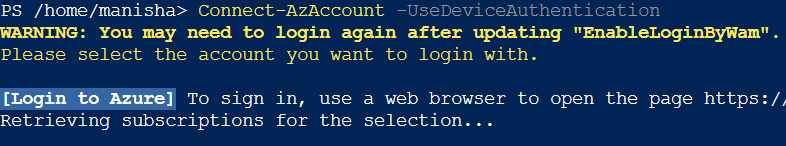
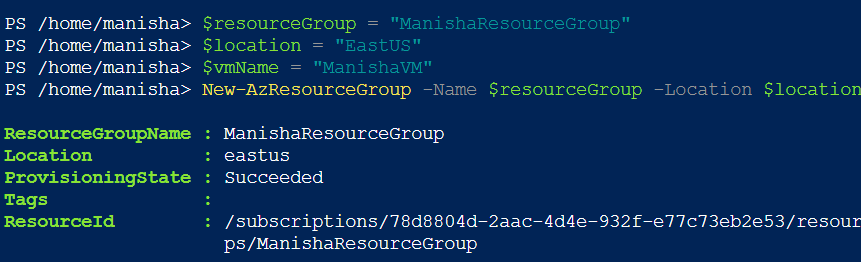
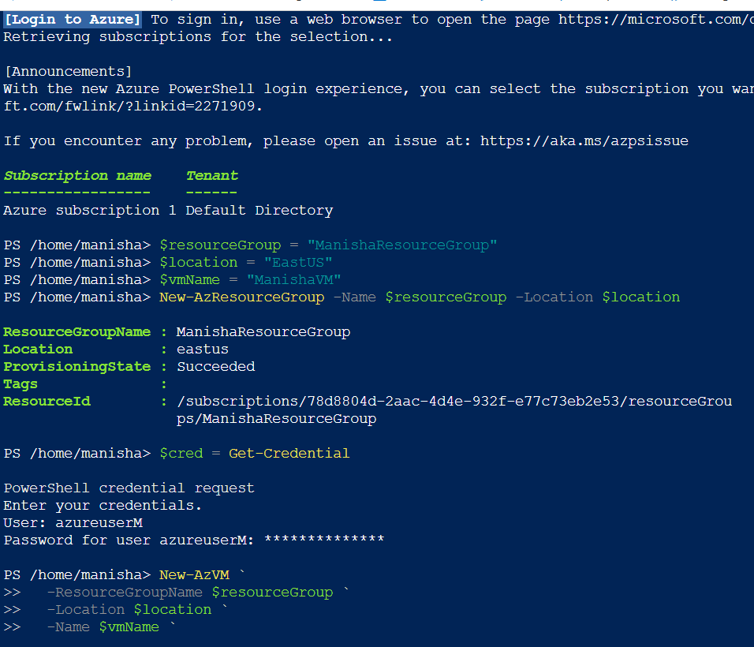
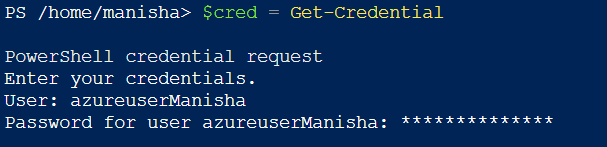
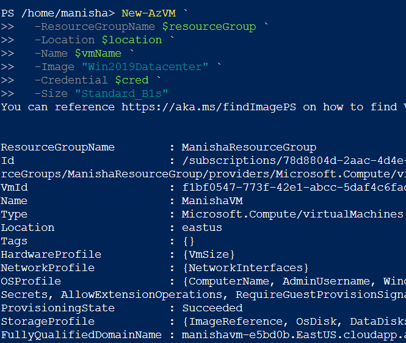

# Azure Task 5: Creating a Virtual Machine with PowerShell

## Objective
As part of my Azure-learning journey, I challenged myself to spin up a Windows Server 2019 virtual machine **entirely from Azure PowerShell in Cloud Shell**—no clicks, just commands. This task is about documenting my experience with creating my first VM using PowerShell in Azure Cloud Shell. I will walk you through the steps I took, highlighting any challenges I faced and how I overcame them. This exercise is crucial for understanding the power and flexibility of Azure PowerShell in managing Azure resources. Let's dive in!

---

## Tools Used
| Purpose | Tool / Cmdlet |
|---------|---------------|
| Interactive PowerShell session | Azure Cloud Shell |
| Azure login | `Connect-AzAccount` |
| Resource group creation | `New-AzResourceGroup` |
| VM provisioning | `New-AzVM` |
| Secure credential prompt | `Get-Credential` |

---

## Steps Performed (Learner’s Perspective)

### 1. Login to Azure with Device Authentication
```powershell
Connect-AzAccount -UseDeviceAuthentication
```
Since we were working inside the Azure Cloud Shell and couldn't use the normal login popup, I used this command to authenticate through a browser. Azure gave me a code, which I had to paste on a login page. Once I did that, I was successfully logged into my Azure account, and now PowerShell could interact with my Azure resources.

Screenshot:  


---

### 2. Set Variables
```powershell
$resourceGroup = "ManishaResourceGroup"
$location = "EastUS"
$vmName = "ManishaVM"
```

---

### 3. Create a Resource Group
```powershell
New-AzResourceGroup -Name $resourceGroup -Location $location
```
In Azure, we can’t just create a VM directly — we need to organize it inside a resource group. So I ran this command, which created a new resource group called "ManishaResourceGroup" in the EastUS region. Think of a resource group like a folder that holds all your cloud stuff together.

Screenshot:  


---

### 4. Azure Login + Resource Group Confirmation (Combined View)  
Screenshot:  


This screenshot captures a quick overview of everything that happened till now — my login to Azure using device authentication, subscription selection, and the creation of the resource group. It’s basically a checkpoint that confirms everything went smoothly before moving on to the actual VM creation.

---

### 5. Set VM Credentials
```powershell
$cred = Get-Credential
```
> Username: `azureuserManisha`  
> Password: Strong Azure-compliant password

Username: This is the admin username for the VM.

Password: Azure only accepts strong passwords (with upper, lower case, number, and special character).

These credentials are important because they’ll be used to connect to the VM later through RDP or SSH.

Screenshot:  


---

### 6. Create the Virtual Machine
```powershell
New-AzVM `
  -ResourceGroupName $resourceGroup `
  -Location $location `
  -Name $vmName `
  -Image "Win2019Datacenter" `
  -Credential $cred `
  -Size "Standard_B1s"
```
This was the final step where I created the VM. I used all the variables I had defined before — like the name, location, and credentials. For the image, I chose Windows Server 2019, and for the size, I used Standard_B1s because it’s small and usually available.

After running this, it took a few seconds, and then I got the message:
```yaml
ProvisioningState : Succeeded
```
That confirmed the VM was created successfully.

Screenshot:  


Output:
```
ProvisioningState : Succeeded
FullyQualifiedDomainName : manishavm-xxxxxx.EastUS.cloudapp.azure.com
```

---

## Task Completion Status
Task successfully completed.  
Virtual Machine created using Azure PowerShell and verified via `ProvisioningState : Succeeded`.

---

## Notes
- VM Size: `Standard_B1s` (lightweight, reliable)
- Region: `EastUS`

This task helped me feel more confident using PowerShell in a real cloud environment. It also showed me how automation can simplify cloud management!