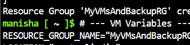
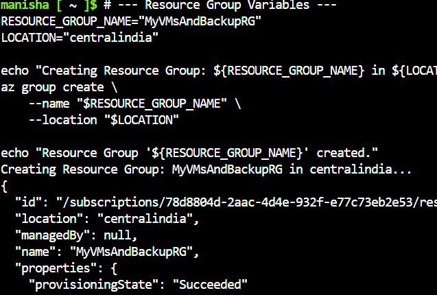
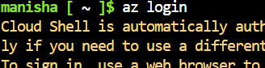
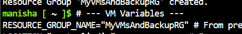
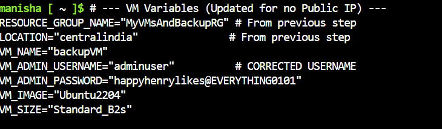
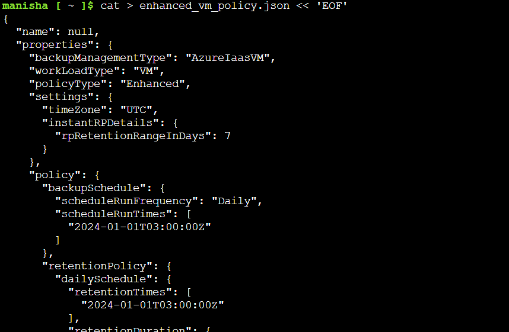
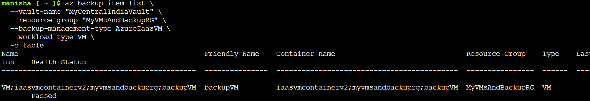
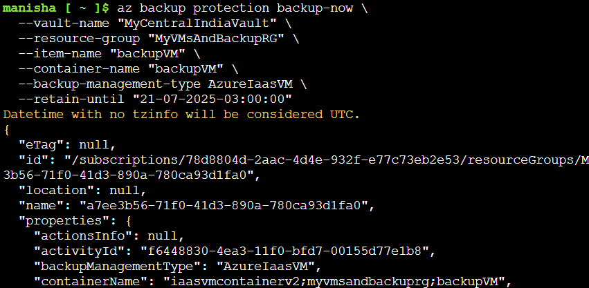
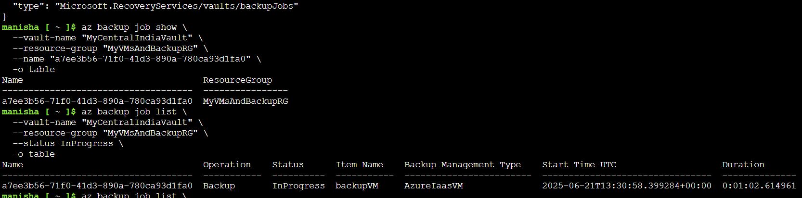
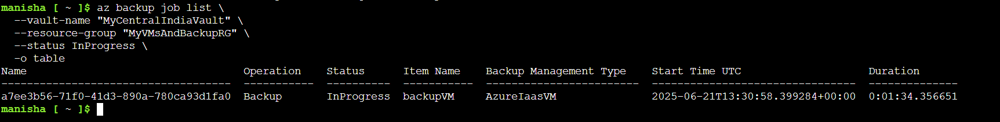

# Azure Task 5: VM Backup Using Enhanced Policy (CLI + Portal)

In this task, we set up backup for an Azure VM using an **Enhanced Backup Policy** through both CLI and the Azure Portal.

---

## 1. Azure Resource Group Creation

We created a resource group `MyVMsAndBackupRG` to contain all related resources. This is a good practice to keep all related resources organized under a single group for easier management. You can create a resource group using the Azure CLI command: `az group create --name MyVMsAndBackupRG --location eastus` or through the Azure Portal by navigating to the "Resource Groups" section and clicking on "Create a resource group". 

---

## 2. Azure Cloud Shell Login

Cloud Shell is automatically authenticated. However, if you need to authenticate manually, you can use the command `az login` to log in to your Azure account. This step is crucial for executing Azure CLI commands. You can also us the Azure Portal to log in to your Azure account. 

---

## 3. VM Environment Variable Setup

Initially and later, we set environment variables for our VM configuration. This includes setting the VM name, resource group name, and the location. We use these variables to ensure consistency in our commands and to easily switch between different VM configurations if needed. You can set environment variables using the Azure CLI command `export VM_NAME="MyVM"` or through the Azure Portal by navigating to the "Settings" section of your VM and clicking on "Configuration". 

---

## 4. Creating Enhanced Backup Policy JSON

We attempted to create a backup policy using a custom JSON file. However, due to the complexity of the JSON structure and the need for a specific format, we encountered issues. The correct format for the JSON file is crucial for the backup policy to be successfully created.

> CLI-based JSON policy creation failed for Enhanced Policies due to Trusted VM restrictions.
---

## 5. Enabling Backup Protection (Using Portal)

Due to CLI limitation, we used the Azure Portal to:

- Create an Enhanced Backup Policy.
- Apply the policy to `backupVM`.

---

## 6. Listing Backup-Protected Items

Verification that `backupVM` is now a backup-protected item. We used the Azure CLI command `az backup-protected-item show --name backupVM --resource-group MyVMsAndBackupRG --output json` to verify the protection status of `backupVM`. This command shows the details of the protected item, including its protection status. You can also use the Azure Portal to verify the protection status by navigating to the "Backup" section and clicking on "Protected Items". 

---

## 7. Triggering On-Demand Backup

We used the CLI to start an immediate backup for `backupVM`. This is done using the command `az backup-protected-item trigger-backup --name backupVM -- resource-group MyVMsAndBackupRG --backup-management-type AzureIaasVM --output json `. This command initiates an on-demand backup for the specified protected item. You can also use the Azure Portal to trigger an on-demand backup by navigating to the "Backup" section, clicking on "Protected Items", and then clicking on the "Backup now" button. 

---

## 8. Checking Backup Job Status

We validated the status of the ongoing backup job via the CLI. The command `az backup jobs show --resource-group MyVMsAndBackupRG --output json ` shows the status of the backup job. You can also use the Azure Portal to check the status of the backup job by navigating to the "Backup" section, clicking on "Jobs", and the "All jobs" tab.

---

## Conclusion

This task demonstrates:

- How to create and apply an enhanced backup policy.
- Fallback to the portal when CLI support is limited.
- Validating backup and tracking jobs from the CLI.
EOF
